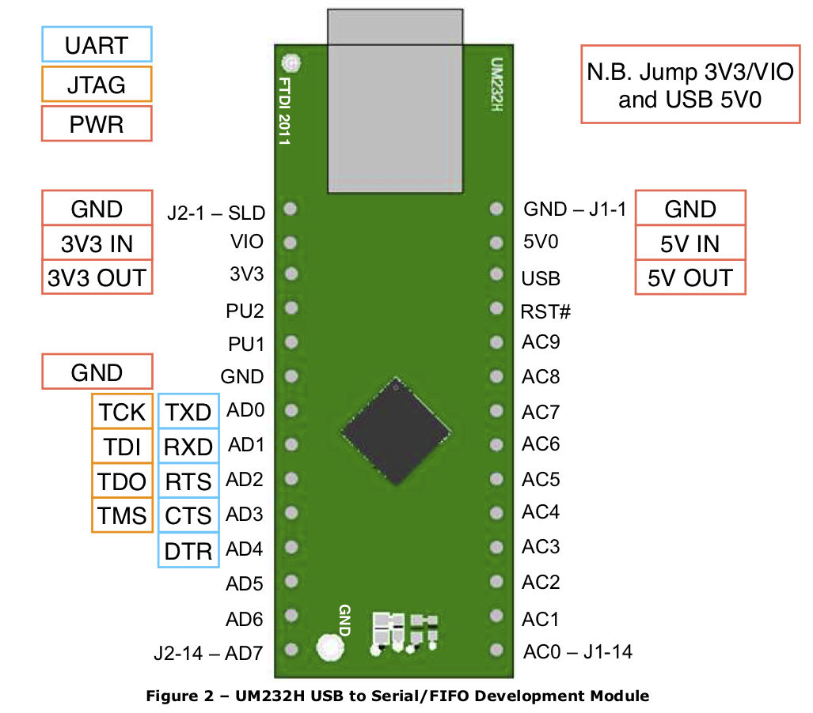

# FTDI UM232H FT232H breakout

Found this in my parts box, no idea why I bought it -- probably though it had an FT2232H.
Note that it's single-channel, it has machine pin headers (so it works excellently in machine pin sockets and terribly with jumpers), and it has the power section broken out rather than connected (so you can configure it as self-powered or USB-powered).
It'd be a good FT232H dev board but it's an inconvenient serial/JTAG adaptor.

