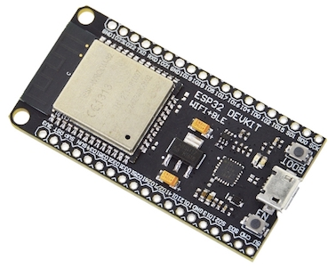
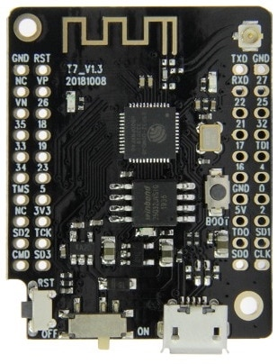

# MH-ET LIVE Minikit (a.k.a. Wemos D1 Mini ESP32)
This is the smallest ESP32 dev board I've found that isn't crippled or expensive.
It's roughly the same size and pinout as the Wemos D1 Mini ESP8266 board.
See [weigu.lu's docs](http://www.weigu.lu/microcontroller/tips_tricks/esp32_tips_tricks/index.html) for more info.

Pinout (from [Riot OS docs](https://riot-os.org/api/group__boards__esp32__mh-et-live-minikit.html)):

I can't find schematics, but there are two similar boards with schematics.
The [MH-ET Live Development Board](https://www.aliexpress.com/item/32813121497.html), which looks like this:

has schematics in a [closed GitHub issue](https://github.com/MHEtLive/ESP32-MINI-KIT/issues/3):

The [LilyGO ESP32-MINI-32-V1.3](https://www.aliexpress.com/item/32846710180.html), which looks like this:

has schematics on [GitHub](https://github.com/LilyGO/ESP32-MINI-32-V1.3/blob/master/Schematic.pdf).

Note that although the schematics have MicrOne ME6211 3.3V 500mA LDOs, many actual boards come with wimpy Torex XC6204A 3.3V 150mA LDOs instead (see e.g. [here](https://www.reddit.com/r/esp8266/comments/9iizx4/warning_clone_wemos_d1_minis_with_only_150ma_33v/)).
This is true for a lot of ESP8266 boards as well.
If the regulator is a SOT25 marked with 4 then A/B/C/D then 2 then another character (e.g., "4A20") then it's probably the Torex part.
Aside from supplying barely enough current to function, the XC6204A also has higher dropout voltage (200mV @ 100mA vs. 120mV) and quiescent current (70µA vs. 70µA).

Note also that a lot of boards use (or claim to use) AMS1117 3.3V 1A LDOs, which have a minimum load current of 5 mA typ (i.e., fall out of regulation under low loads) and 5 mA typ quiescent current (not µA).
