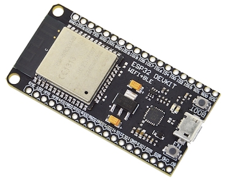
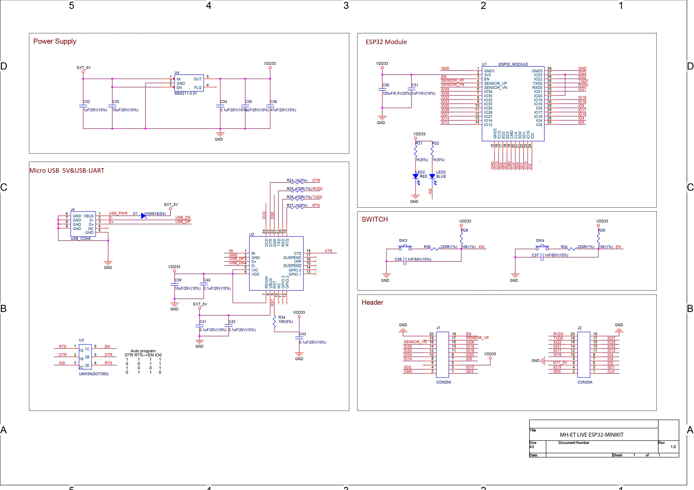
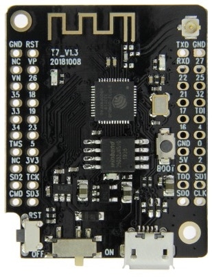

# MH-ET LIVE Minikit (a.k.a. Wemos D1 Mini ESP32)
This is the smallest ESP32 dev board I've found that isn't crippled or expensive.
It's roughly the same size and pinout as the Wemos D1 Mini ESP8266 board.
See [weigu.lu's docs](http://www.weigu.lu/microcontroller/tips_tricks/esp32_tips_tricks/index.html) for more info.

Pinout (from [Riot OS docs](https://riot-os.org/api/group__boards__esp32__mh-et-live-minikit.html)):

I can't find schematics, but there are two similar boards with schematics.
The [MH-ET Live Development Board](https://www.aliexpress.com/item/32813121497.html), which looks like this:

has schematics in a [closed GitHub issue](https://github.com/MHEtLive/ESP32-MINI-KIT/issues/3):

The [LilyGO ESP32-MINI-32-V1.3](https://www.aliexpress.com/item/32846710180.html), which looks like this:

has schematics on [GitHub](https://github.com/LilyGO/ESP32-MINI-32-V1.3/blob/master/Schematic.pdf).
