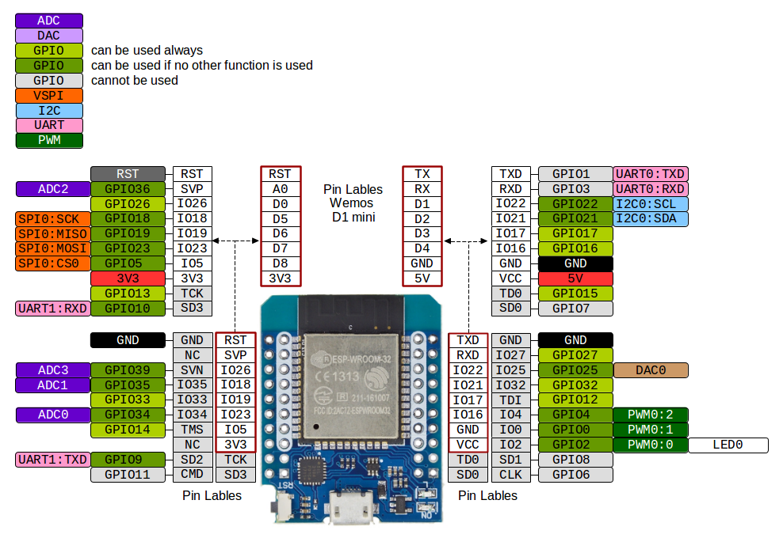

# MH-ET Live (a.k.a. Wemos D1 Mini ESP32)
This is the smallest ESP32 dev board I've found that isn't crippled or expensive.

Pinout (from [Riot OS docs](https://riot-os.org/api/group__boards__esp32__mh-et-live-minikit.html)):

